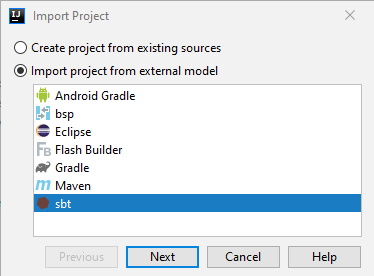
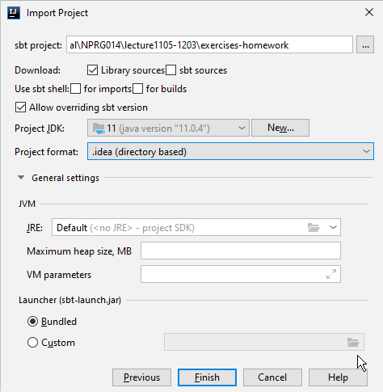
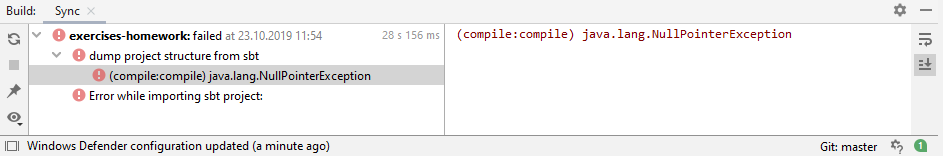
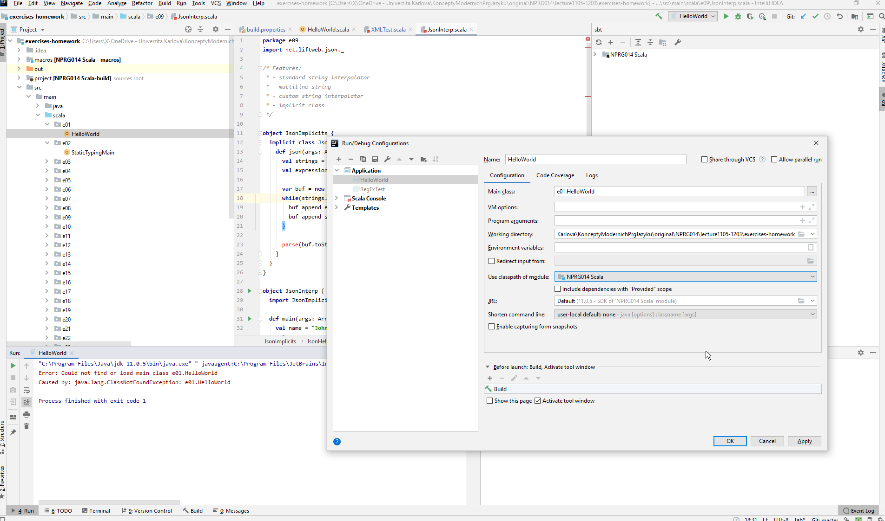
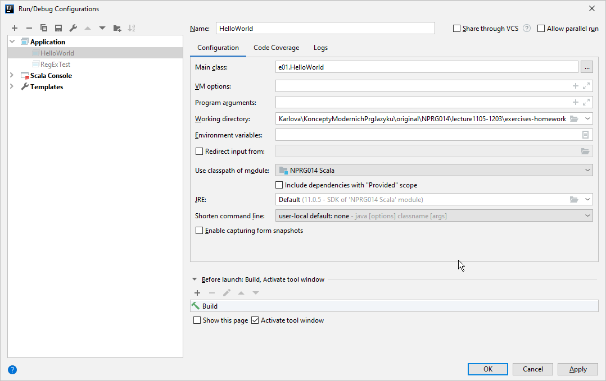

# Setup for working scala configuration

## Prerequisites:

installed packages in following versions:

* JDK 21
  * https://www.oracle.com/java/technologies/downloads/
  
* SBT
  * https://www.scala-sbt.org/download.html
  
* Scala
  * https://www.scala-lang.org/download/
  
* IntelliJ IDEA
  * https://www.jetbrains.com/idea/download/

### Scala can be directly downloaded and installed trough the IDEA by Creating Scala Project:

* Open up IntelliJ and click File => New => Project
* On the left panel, select Scala. On the right panel, select IDEA.
* Name the project e.g. ToDelete
* To the right of the Scala SDK field, click the Create button.
  Select the highest version number and click Download. This might take a few minutes but subsequent projects can use the same SDK.
  Once the SDK is created and you’re back to the “New Project” window click Finish or discard whole project.

## Importing the project from git to IDEA

* Open IDEA

* Select File > New > Project from existing sources

* Locate folder "exercises-homework":  under NPRG014\lecture-scala\exercises-homework

* Select Import project from external model
  * and select "sbt"
  * In next window keep defaults (Only selected item is Download Library sources)

Confirm that hello world under ./src/main/scala/e01 works. 
			(select file in the tree and click Run HelloWorld (Ctrl+Shift+F10))

If that works, your IDEA is configured properly.

# Dealing with common errors

## Try the import again with different settings

*In case this setup does not work try to trigger selectors during the import project in sections "Download" and use "sbt shell"* as seen in the previous picture 

## dump project structure fails with null pointer exception

Edit file "./project/build.properties" to contain "sbt.version = 1.10.0" (or current latest version this is mainly for future reference since the file has already been changed to contain this version)

## Many missing classes

To fix errors like: "Error could not find or load main class e01.HelloWorld"  in Run/Debug configuration under Use classpath or module choose "NPRG014 Scala" 

